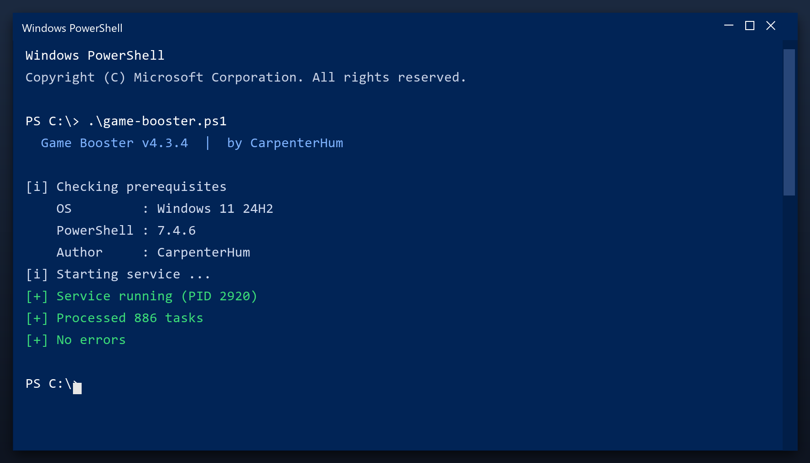

# Download Game Booster for Free — Latest 2026 Version

 

**Game booster** is a Windows utility that keeps your PC clean and running fast. It is the current 2026 build, tested on Windows 10 and 11. **Free. No registration. No bundled adware.**

  

  

## Questions & Answers

**Is it free?**

Yes - no cost and no subscription.

**Is it a virus?**

No. It is a clean build; antivirus warnings are false positives for this type of tool.

**Can it break my PC?**

No - it makes a backup first, so any change can be undone.

**How often should I run it?**

Once a month is enough for most computers.

**The download does not start - what now?**

Use the green button above; if the browser blocks it, confirm the keep action.

## What Is It

Game booster does three things: it finds junk files, it finds broken settings, and it removes them. That is the whole tool - no social features, no accounts, no ads. It runs as a normal Windows program and works fully offline after you download it.

| **Term** | **Meaning** |
| --- | --- |
| **Junk** | Files no program needs any more |
| **Broken entry** | A setting that points to nothing |
| **Cache** | Temporary data stored for speed |
| **Offline** | Works without an internet connection |

## The Problem

- **Slow performance** - too many background programs start with Windows
- **Cluttered disk** - temporary files and leftovers build up over time
- **Registry errors** - broken entries cause errors and crashes
- **Hard to find settings** - Windows hides the useful options
- **Bundled junk** - many free tools install adware or toolbars

## The Fix

| **Problem** | **Solution** |
| --- | --- |
| **Slow startup** | Disable unneeded startup items |
| **Cluttered disk** | Remove junk and temp files |
| **Registry errors** | Scan and repair broken entries |
| **Hidden settings** | One clear control panel |
| **Bundled junk** | Clean installer, no adware |

## Step by Step

1. **Get the file** with the button below
2. **Allow** it in Windows SmartScreen (More info, Run anyway)
3. **Open** the tool
4. **Press Start scan** and wait a couple of minutes
5. **Click Clean** to remove what was found

> **Note:** on first launch Windows may show a SmartScreen warning because the file is new. Click More info, then Run anyway.

## Features

| **Feature** | **Details** |
| --- | --- |
| **Windows** | 11, 10 (64-bit) |
| **Scan time** | 1-3 minutes |
| **Backup** | Automatic before changes |
| **Memory use** | Very low |
| **Price** | Free |
| **Internet** | Not required to run |

## Requirements

| **Component** | **Minimum** | **Recommended** |
| --- | --- | --- |
| **OS** | Windows 10 | Windows 11 (64-bit) |
| **RAM** | 2 GB | 4 GB |
| **Disk** | 100 MB free | 500 MB free |
| **Network** | For download | For updates |

## What You Get

| **Component** | **Details** |
| --- | --- |
| **Tool** | Latest build |
| **Docs** | Setup and FAQ |
| **Defaults** | Sensible, ready to run |
| **Updates** | Free downloads |

## Tips

- Do not run two cleaners at the same time
- Use the preview to see what will be removed
- Keep the restore point until you are sure
- Re-scan after installing big programs
- Back up documents before any deep clean

## Troubleshooting

| **Issue** | **Fix** |
| --- | --- |
| **High CPU during scan** | Expected - it throttles when you use the PC |
| **Antivirus blocks cleanup** | Add an exclusion for the tool |
| **Cleanup leaves temp files** | Some are locked - reboot and rescan |
| **Tool asks for admin** | Approve it so it can clean system areas |

## Summary

**Game booster** is the maintenance tool for people who do not want to think about maintenance. Install it, press scan, and it tells you - in plain words - what can be cleared.

- One window, obvious buttons
- A clear report before anything changes
- Full undo if you want it
- Completely free

**Grab the latest 2026 build above.**

---

*nimble-willow-479 · Updated 2026-10-09 · Shared under the MIT License*
